**COBRA KAI WEBSITE MIGRATION TO CLOUD**

**Abhijeet Marikal**

**Contents**

[**PROPOSED ARCHITECTURE**](#proposed-architecture)

[**MIGRATING COBRA-KAI INTO CLOUD**](#migrating-cobra-kai-into-cloud)

[**Migration Steps:**](#migration-steps)

[**AWS LOAD BALANCER**](#aws-load-balancer)

[**Configuring ALB**](#configuring-alb)

[**IDENTITY AND ACCESS MANAGEMENT**](#identity-and-access-management)

[**Roles and Responsibilities**](#roles-and-responsibilities)

[**AWS WEB ACCESSS FIREWALL**](#aws-web-accesss-firewall)

[**Configuring AWS WAF**](#configuring-aws-waf)

[**AWS Key Management Service**](#aws-key-management-service)

[**USE OF LAMBDA WITH AWS KMS**](#use-of-lambda-with-aws-kms)

[**AWS Inspector**](#aws-inspector)

[**Configuring AWS inspector**](#configuring-aws-inspector)

[**Amazon Route 53**](#amazon-route-53)

[**Configuring Route53**](#configuring-route53)

[**AWS CloudFront**](#aws-cloudfront)

[**Configuring CloudFront**](#configuring-cloudfront)

[**Patch Manager**](#patch-manager)

[**Configuring Patch Manager:**](#configuring-patch-manager)

[**AWS Backup**](#aws-backup)

[**Configuring a Backup Plan**](#configuring-a-backup-plan)

# **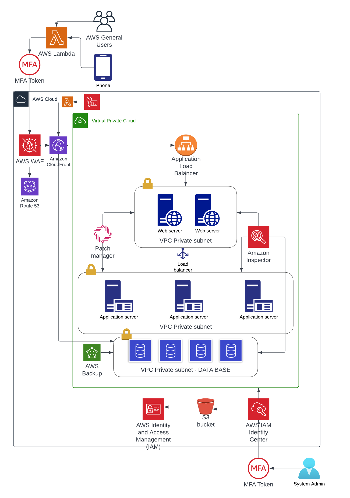PROPOSED ARCHITECTURE**

| **MIGRATING COBRA-KAI INTO CLOUD**                                                                                |                                                                                                                                                                                                                       |
|-------------------------------------------------------------------------------------------------------------------|-----------------------------------------------------------------------------------------------------------------------------------------------------------------------------------------------------------------------|
| 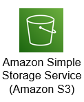      | **Amazon S3** It is a service which helps in storing objects along with this it offers high scalabitly and avaialblity. It also provides good security and high performance. This helps in optimizing costs and data  |

## **Migration Steps:**

Here we will be using S3 bucket to migrate cobrakai website to the cloud

-   I created a bucket which is encrypted and used US east 1 as the region

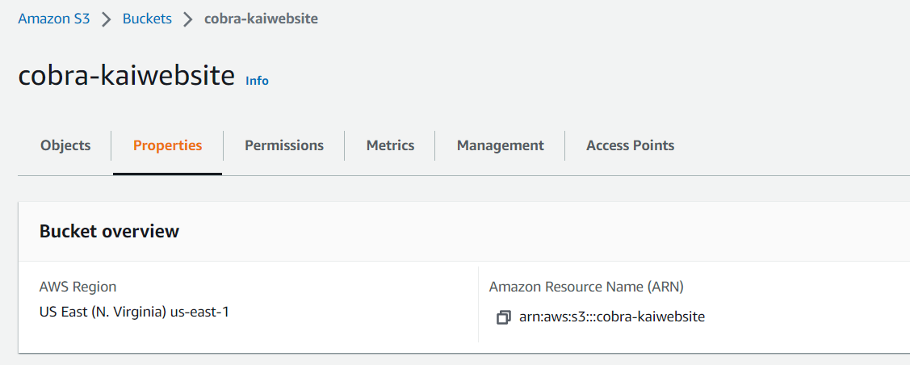

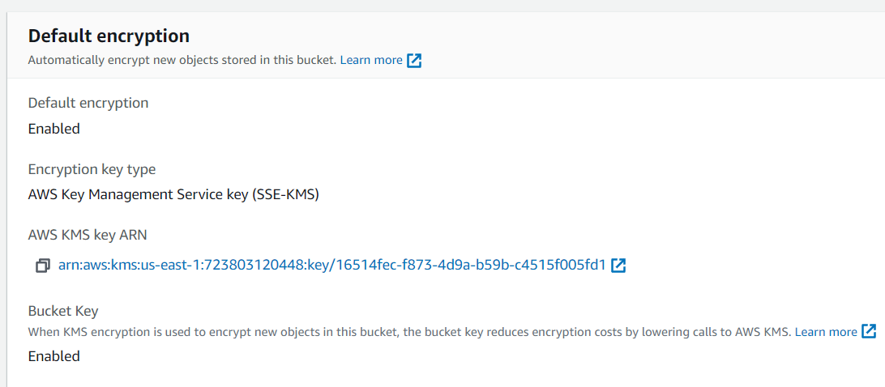

-   Then we need to upload the given OVA file into the S3 bucket

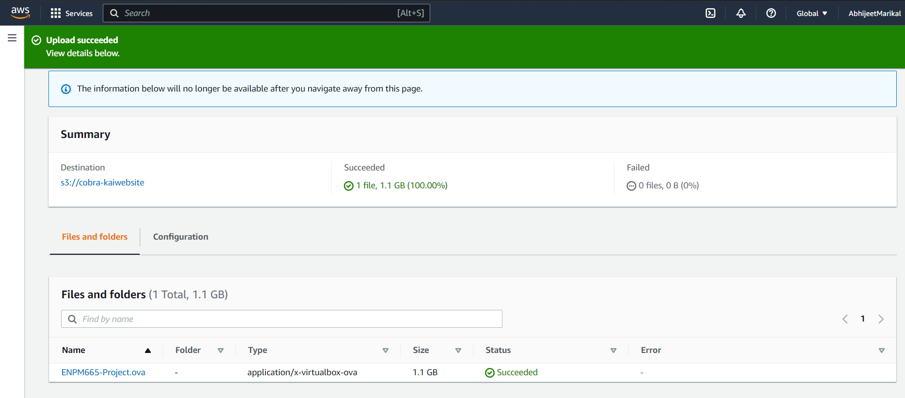

-   After successfully uploading cobra kai ova file into S3 we need to setup IAM role named ‘Vmimport’
-   For the created IAM role we add the below inline policy

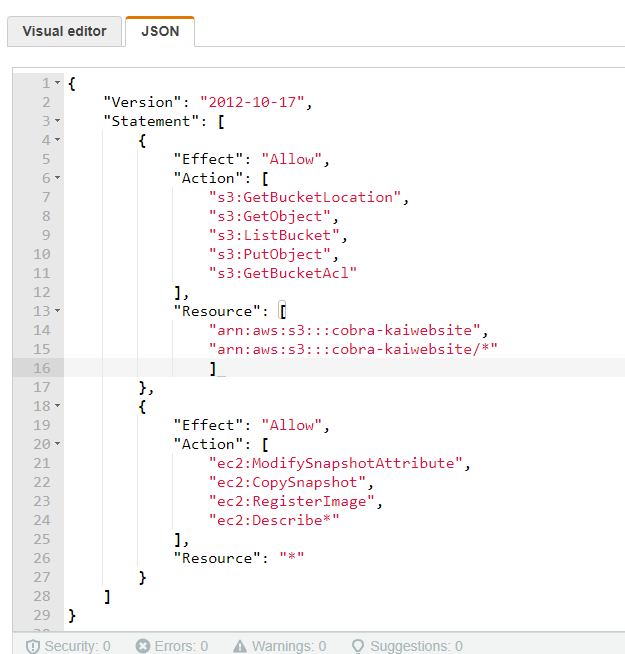

-   Then we add the below trust policy to the role. This gives our role permission to import/export vm by using vmie.amazonaws.com

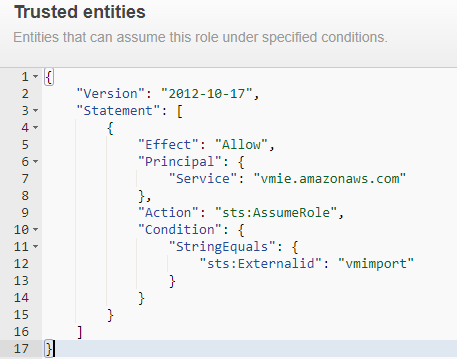

-   Below we can the created policy are added to the role

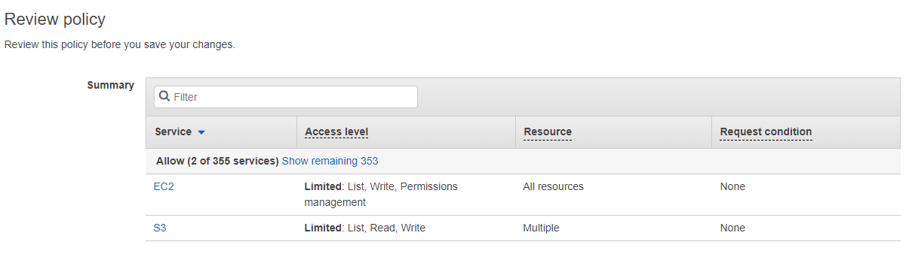

-   Now that the S3 bucket and IAM roles are setup. We need to create a json file which helps in importing the image using AWS CLI

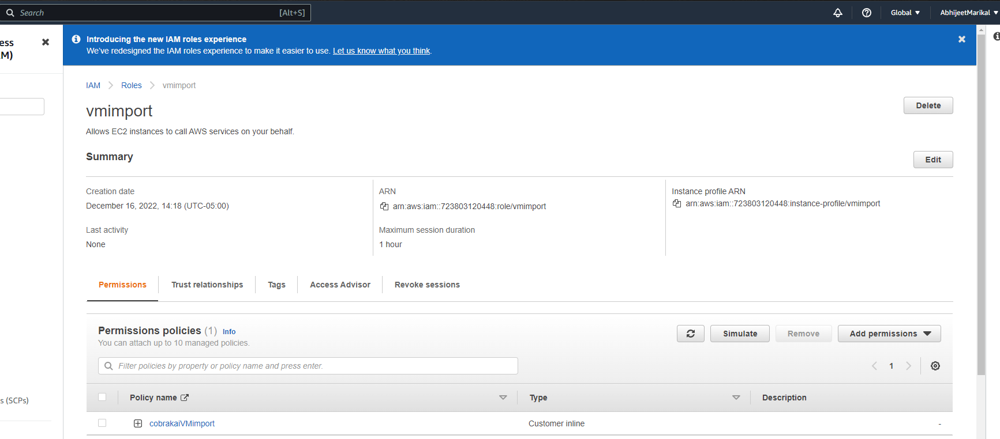

-   We create a json file , here I gave the url of cobrakai ova present in the S3 bucket

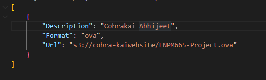

-   Then using CLI we import this file to by using the following command in the below screenshot
-   This creates the EC2 intance with our image

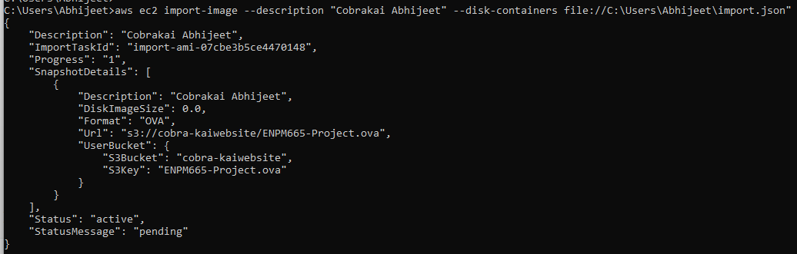

-   We can also check the status of the import by using the following cmds
-   After successfully imporing the image the status changes to complete as shown below

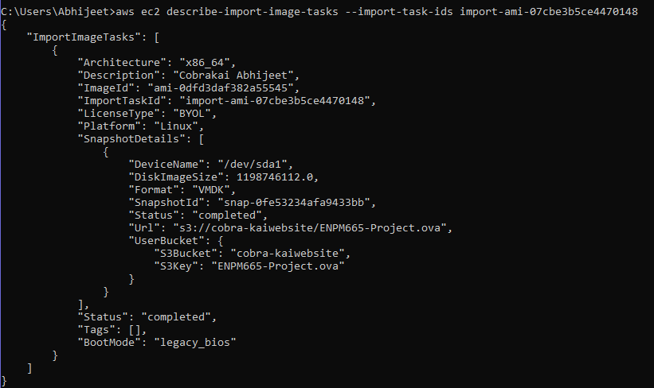

-   In Amazon Machine Images tab we can see that the image is available and ready to launch

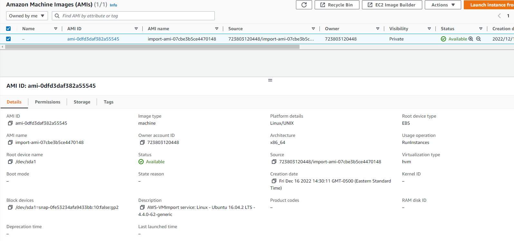

| **AWS LOAD BALANCER**                           |                                                                                                                                                             |
|-------------------------------------------------|-------------------------------------------------------------------------------------------------------------------------------------------------------------|
| 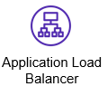 | **AWS Application balancer** We will be using application load balancer as it helps in easy distribution HTTP and HTTPS traffic among various applications. |

## **Configuring ALB**

-   Now we create load balancer for our website we will be using Internet facing scheme with IP address type to IPv4

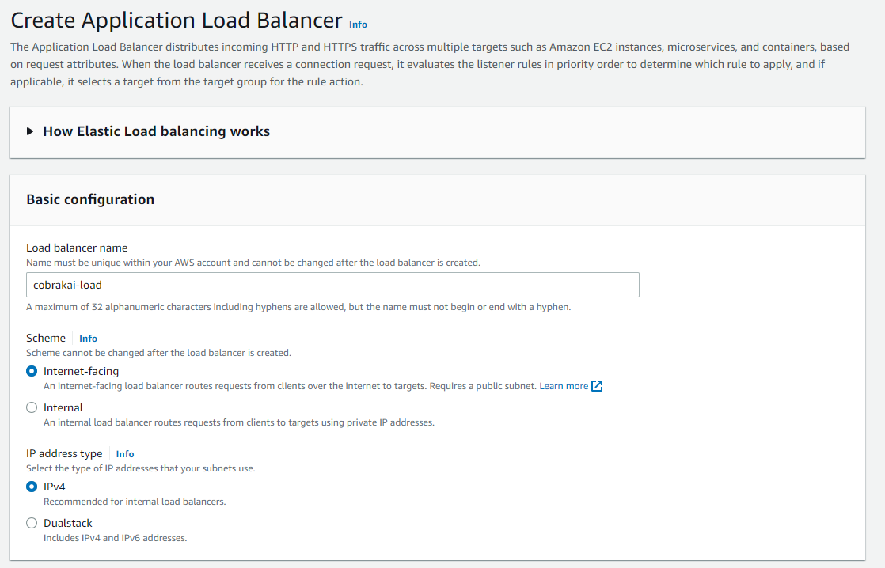

-   And we need to setup listerner protocal to HTTP and port 80
-   Next we set up the VPC to the VPC of Cobrakai EC2 instance
-   Then we create security group with source 0.0.0.0 and port 80. We do this because it helps everyone to access cobra kai website .

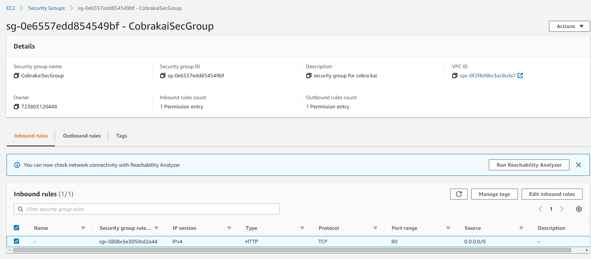

-   After creating the security group we setup Target group with target type to instance and http with 80 port

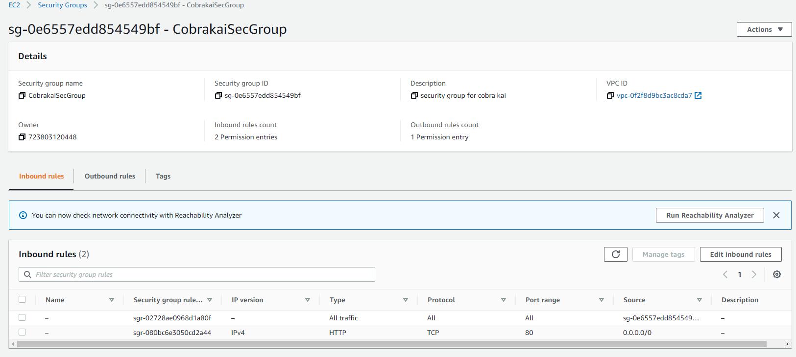

-   Then we register the EC2 instace in the register targets page

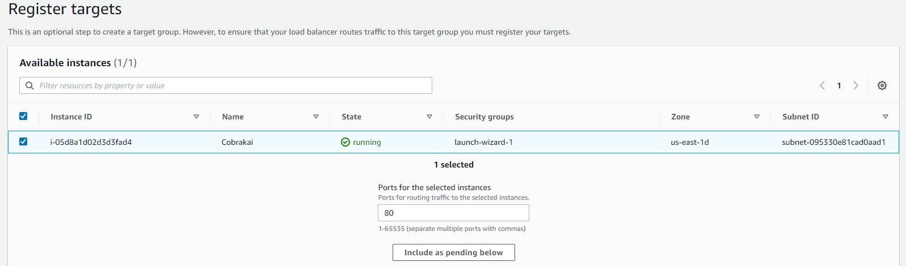

-   Below we can the summary where we set up 2 subnets us-east1-d and us-east-1b, us-east-1d is used by our EC2 intance and one more us-east-1b for high availablty of load balancer

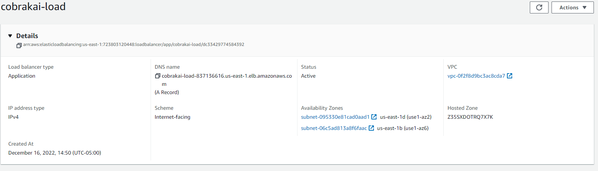

-   After final setup we can launch our website reachable by our loadbalancer

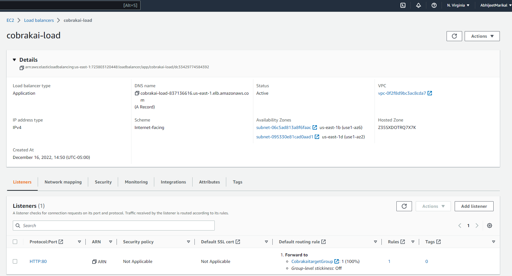

-   Now we can check that the website is using our load balancer to display the website

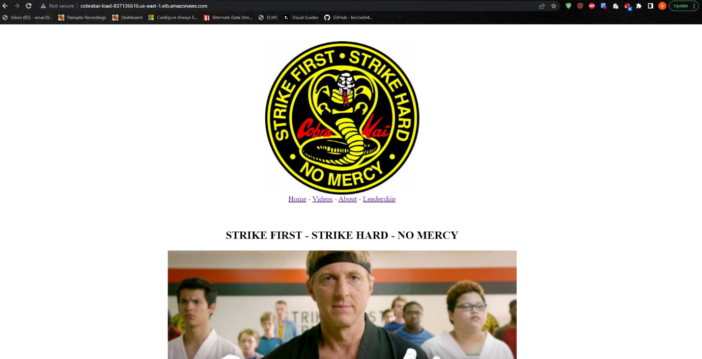

| **IDENTITY AND ACCESS MANAGEMENT**                                                                                                                                                                                                   |                                                                                                                                                                                                                                                                                                                                                                                                                                                                                                                                                                                                                                                                                                                                                                                                                                                                                        |
|--------------------------------------------------------------------------------------------------------------------------------------------------------------------------------------------------------------------------------------|----------------------------------------------------------------------------------------------------------------------------------------------------------------------------------------------------------------------------------------------------------------------------------------------------------------------------------------------------------------------------------------------------------------------------------------------------------------------------------------------------------------------------------------------------------------------------------------------------------------------------------------------------------------------------------------------------------------------------------------------------------------------------------------------------------------------------------------------------------------------------------------|
| 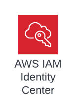 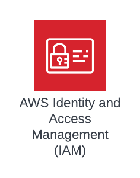    | **AWS IAM Identity Center:** The Proposed architecture uses IAM Identity Center which is the descendant to AWS SSO when enabled this will allow the system admin to control and manage his workforce identities across all accounts. This also helps in assigning users to specific applications  **AWS Identity and Access Management (IAM):** AWS IAM is a service accessible within AWS which helps in access control, it authenticates and authorizes who can access the resources  Amazon Identity and Access Management (IAM) is mainly used for controlled access of AWS resources to the users. With this System admin can assign user permissions to specific resources    **MFA Token:** MFA is multifactor authentication mechanism which we will be including on the website. Where both root users and IAM users must pass through to get into the website or the server  |

**Usage:**

IAM identity center helps in setting up workforce identifiers, Application assignments for SAML applications, multi account permission which helps in implementing IAM permissions across many multiple AWS accounts and it also has AWS Access portal

MFA token has different methods like FIDO Security Keys and various virtual authenticator apps (Duo mobile, Microsoft authenticator, google authenticator)

# 

-   Whenever there is a role or user is created, it is responsibility of system administrator to assign correct roles to the users.
-   After that System administrator is required to add required permissions to the roles such that privileges are not same for all users.
-   System managers, executives and developers must have higher privileges which must vary according to their roles. Whereas end users have minimum privileges as they only interact with the frontend
-   But everyone irrespective of their roles must authenticate themselves by going through Multifactor authentication (MFA).
-   This solves the problem of not have a proper account permission strategy and prevents end users from accessing the web server.

## **Roles and Responsibilities**

These responsibilities will be included in IAM Polices such that level of privileges vary among the users

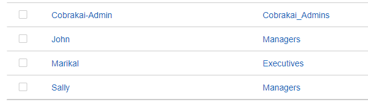

For the above Created IAM user we have to give the following permissions

| Title                                                                                                                                                                                                          | Role                                                     |
|----------------------------------------------------------------------------------------------------------------------------------------------------------------------------------------------------------------|----------------------------------------------------------|
| Executives                                                                                                                                                                                                     | This role is for Cobra kai board who manage the company  |
| RESPONSIBILITIES                                                                                                                                                                                               |                                                          |
| Monitors all the resources by making use of Amazon CloudWatch. Suggests modifications to the resources  Needs to authorize time to time changes on the website Assists the system admin in case of escalations |                                                          |

| Title                                                                                                                                                                                                                                                                                                                                                                                                                                                                                                                                                         |                                         | Role |
|---------------------------------------------------------------------------------------------------------------------------------------------------------------------------------------------------------------------------------------------------------------------------------------------------------------------------------------------------------------------------------------------------------------------------------------------------------------------------------------------------------------------------------------------------------------|-----------------------------------------|------|
| Cobrakai-admins                                                                                                                                                                                                                                                                                                                                                                                                                                                                                                                                               | This role is for system administrator   |      |
| RESPONSIBILITIES                                                                                                                                                                                                                                                                                                                                                                                                                                                                                                                                              |                                         |      |
| Monitors all the resources by making use of Amazon CloudWatch. Can change, modify, and delete resources and roles. Has the permission to create new roles and users.  Has permission to application migration service resources Regularly backup and maintain data by using AWS Backup manager. Uses Aws IAM identity center to give IAM permissions across multiple platforms. Helps in cost optimization by monitoring the billing and development strategies. Maintains data integrity and access control. Will have ‘AdministrativeAccess’ policy applied |                                         |      |

| Title                                                                                                                                                                                                                                                                                                 | Role                                      |
|-------------------------------------------------------------------------------------------------------------------------------------------------------------------------------------------------------------------------------------------------------------------------------------------------------|-------------------------------------------|
| Manager                                                                                                                                                                                                                                                                                               | This role is for Managemental positions   |
| RESPONSIBILITIES                                                                                                                                                                                                                                                                                      |                                           |
| Monitors all the resources by making use of Amazon CloudWatch. Can change, modify, and delete resources by escalating. Helps in cost optimization by monitoring the billing and development strategies. Maintains data integrity and access control. Will have access to EC2 instances and databases  |                                           |

| Title                                                                                                                                                                                                             | Role                                                               |
|-------------------------------------------------------------------------------------------------------------------------------------------------------------------------------------------------------------------|--------------------------------------------------------------------|
| End users                                                                                                                                                                                                         | This role is for application users who interact with the website   |
| RESPONSIBILITIES                                                                                                                                                                                                  |                                                                    |
| Can access the website via internet  Must pass through Multifactor authentication to login  Can access links on the website Can order video on demand by placing an order  Buy video with the help of credit card |                                                                    |

| **AWS WEB ACCESSS FIREWALL**                    |                                                                                                                                                                                            |
|-------------------------------------------------|--------------------------------------------------------------------------------------------------------------------------------------------------------------------------------------------|
| 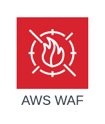 | **AWS WAF:**  As DDOS attacks are most common on websites we will be using AWS WAF which Access controls lists.  These ACLs filter out the incoming packets according to their severity    |

**Usage:**

-   This firewall has rules which sort traffic according to their rate.
-   Whenever is an unauthorized access or activities it keeps logging in AWS WAF Logs for future purposes.
-   Block bad requests which are coming from other countries not in our business region by creating a geo match rule
-   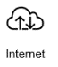Uses IP set match rule to block out bad Ip address
-   Every time when there is a bad request or an unauthorized access these must pass through the rules set where filtering takes place
-   After this the bad access are detected, these are labelled according to their rates and level of severity.
-   And are logged in AWS WAF logs
-   *AWS WAF is the best possible solution to stop the incoming malicious traffic from Daniel LaRusso’s side*. While setting up the ACLs we can specifically give which traffic is allowed and which needs to stop at the firewall. And, as we are using VPC in the architecture it is harder to reach the private subnet which stores the servers

## **Configuring AWS WAF**

-   For setting up web access firewall for cobra kai website we need to create Web ACL
-   Fill in the necessary details and selecting the resource type to REGIONAL RESOURCES, which associates Application load balancers.
-   Then we create WAF rule by adding rules in *Add rules and rules groups.*
-   After creating the WAF this service will help in sorting our malicious traffic

    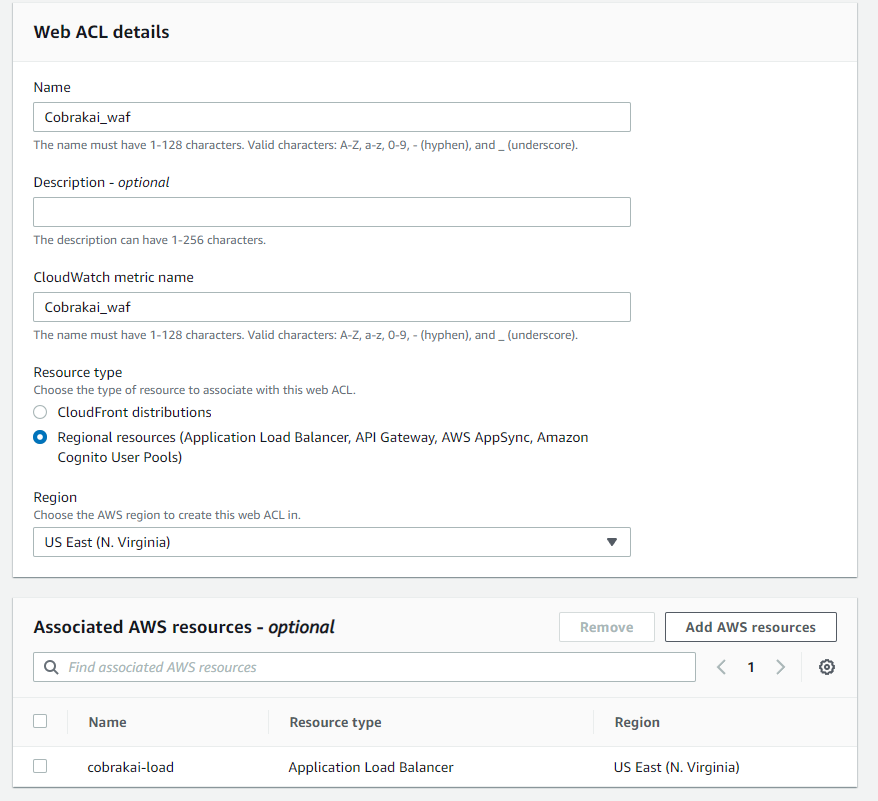

| **AWS Key Management Service**                  |                                                                                                                                                                                                                              |
|-------------------------------------------------|------------------------------------------------------------------------------------------------------------------------------------------------------------------------------------------------------------------------------|
| 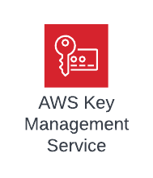 | **AWS Key Management Service:** AWS KMS keys are used for data encryption, this is also used to encrypt all S3 buckets, RDS databases with their separate keys and keeps tracks of all the places where the keys were sent   |

**Usage**

In the above architecture I have used an AWS Lamba function to which will send the public keys of the encrypted data to be openly distributed and private keys to be securely stored in the network core and the encrypted sensitive data is send through AWS Cloud Front to be stored as cipher text in the server.

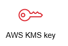

-   Even though variables are encrypted at rest in Lambda, but if we are using console to log in, we still see them in a plain text format so encryption at rest is necessary.
-   This solves the problem by safely processing credit card details and customer PII data

## **USE OF LAMBDA WITH AWS KMS**

1.  **AWS KMS key creation**

    First, we create a key which helps in encryption if the data

2.  **Granting KMS permissions for LAMBDA**

    For that we need to create an IAM policy which grants access for our lambda function here we use action “*KMS: Decrypt*”

    And we also apply permission only to our lambda such that no other resources can have this access key except the admin

3.  **Encryption at runtime**

    Now we modify the lambda function such that the data decryption only occurs at run time while not at rest.

    We can use the following snippet in the lambda function

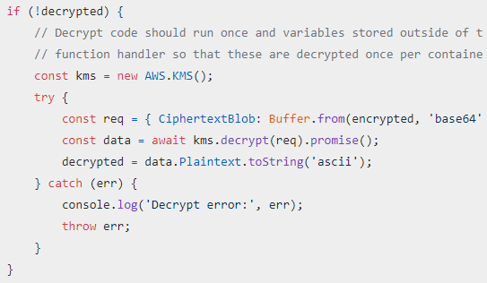

| **AWS Inspector**                               |                                                                                                                                                                                                                                                                                                                                                                                                                      |
|-------------------------------------------------|----------------------------------------------------------------------------------------------------------------------------------------------------------------------------------------------------------------------------------------------------------------------------------------------------------------------------------------------------------------------------------------------------------------------|
| 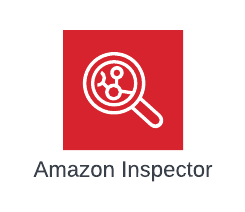 | **AWS Inspector:** We enable Aws inspector as this is a vulnerability management service that is easy to enable across the organization, AWS inspector’s integration with organizations simplifies multi account management and centralizes findings for the security team, this also automatically discovers workload such as EC2 instances and scans for vulnerabilities and sorts them according to risk scores.  |

**Usage:**

-   We use this for protection against DDOS attacks.
-   In case of hardware failures inspectors triggers the admin regarding this.
-   And most importantly analysis human errors which can cause system misconfiguration

    **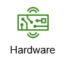**

-   Amazon inspector scans all the resources and looks for any suspected failures or attacks then it conceptualizes these findings into readable form
-   These findings are sent to the system admin and actions are taken immediately
-   This is most useful in remediating zero-day vulnerabilities as it uses over 50 sources to look against which make it easier to find zero-day vulnerability.
-   And sends this to patch manager to update the settings accordingly

## **Configuring AWS inspector**

-   We need to go to AWS inspector to enable it and specify our EC2 instance which has the Cobra kai website
-   Below we can see an enabled and working AWS inspector producing Errors in our instance

    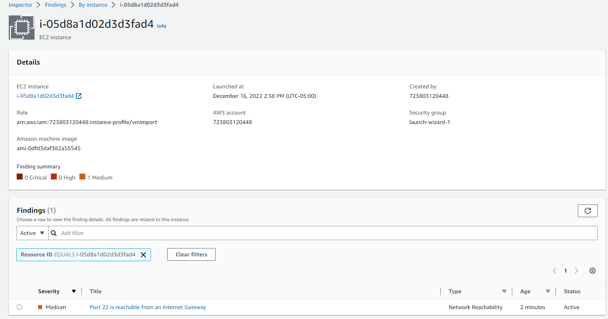

| **Amazon Route 53**                                                                                                 |                                                                                                                                                                                                    |
|---------------------------------------------------------------------------------------------------------------------|----------------------------------------------------------------------------------------------------------------------------------------------------------------------------------------------------|
| 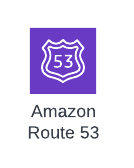 | **Amazon Route 53** AWS offers web service like Route 53 which is always available and highly scalable DNS. This helps us to connects users’ requests to the resource applications running on AWS  |

**Usage:**

-   It connects request to load balancers, EC2 instances, S3 buckets etc.
-   With the help of Amazon Route 53 we will solve the problem of not having a corporate Ip range here we will set up the Ip range for cobra kai website which is 129.2.0.0/16
-   Importing a *JSON* files containing the allowed Ip ranges makes it easier

**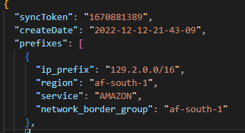**

-   When end users try to access the website, their requests pass through the DNS Resolver and bad requests get sorted out
-   Then the requested site is routed using the routing tables of the website
-   After fetching the website, it checks for the completeness of the website and delivers it to the end users

****

## **Configuring Route53**

-   Now we need to setup route 53, for this we create a hosted zone
-   And give out domain name etc.
-   Then we need to save it as public hosted zone
-   Now we need to create record with the following record name and types

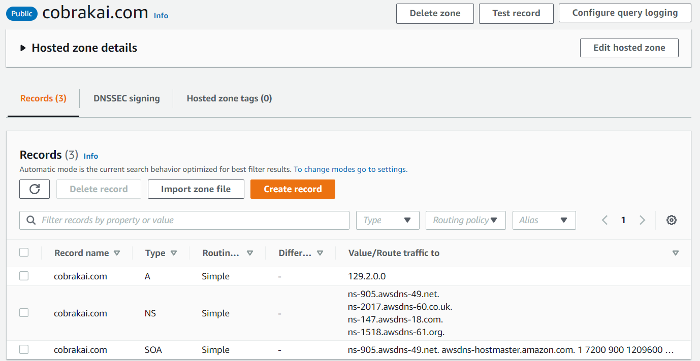

| **AWS CloudFront**                              |                                                                                                                                                                                                                                                                                |
|-------------------------------------------------|--------------------------------------------------------------------------------------------------------------------------------------------------------------------------------------------------------------------------------------------------------------------------------|
| 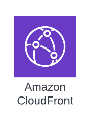 | **AWS CloudFront** AWS CloudFront ensures fast delivery of content as it routes each request through the AWS backbone network to the end site in best possible way. Using this performance is also increase as it decreases the number of networks the requests pass through.  |

**Usage:**

-   By using this user gets lower latency and higher data rates during data transfer of the file
-   All requests are routed by AWS Route 53 Amazon CloudFront
-   As AWS CloudFront points to S3 bucket it continuously downloads static things
-   It caches static and dynamic content which are easily accessible to the end users
-   And uses amazon route 53 to connect load balances, instances and s3 buckets

**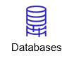**

-   When end users try to stream or download anything from the site, they get it with low latency and fast speed as the content requested is already cached at the edge location.
-   This also solves the problem for time order to be placed as it provides faster processing time as the requests do not need pass through multiple networks for delivery.
-   This scales automatically to deliver smooth and uninterrupted content with higher transfer rates.
-   Defense against DDOS attacks is a bonus as it cost no extra charge

## **Configuring CloudFront**

-   After setting up Route 53 we setup CloudFront which will convey requests to out cobra kai S3 bucket
-   First, we create a distribution with our S3 bucket’s API endpoint
-   Then we setup protocols to HTTP and HTTPs
-   Now we need to set up an SSL certificate and set it to cobra kai website so that CDN can use it
-   Then we create the distribution

**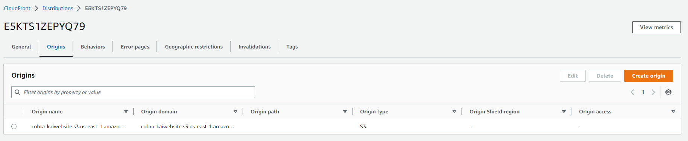**

| **Patch Manager**                                                                         |                                                                                                                                                                                                                                   |
|-------------------------------------------------------------------------------------------|-----------------------------------------------------------------------------------------------------------------------------------------------------------------------------------------------------------------------------------|
| ** | **Patch Manager:** Aws system manager does patch management here it combines AWS IAM and Cloud trail. Which provides a safe and secure patch management.  This has the ability to send event notifications and usage is audited   |

**Usage**: This scans the instances for any missing patches and installs any missing patches.

Patch manager also generates patch compliance reports that can be sent to S3 bucket of our choice

-   Patch manager helps us to scan instances to search for missing, outdates instances automatically by promoting to the system administrator
-   Scheduling of patches is done by maintenance window, where we can set a particular task which patches our given group instances mentioned in the maintenance window. This can be set to regular basis
-   Here Patch baselines are like guidelines which are used for automatic approval of patches for the date of release
-   This solves our issue of **no proper patching** of cobra kai website

## **Configuring Patch Manager:**

-   First, we create an IAM role for admin
-   After creating the IAM role **AmazonEC2RoleforSSM** policy to it.
-   Then we install the SSM agent for our instances
-   We can create a patch baseline
-   Then we integrate baselines to patch groups
-   Creation of maintenance window for scheduling
-   Start the Patch manager.

**Maintenance Window**: For scheduling patches

**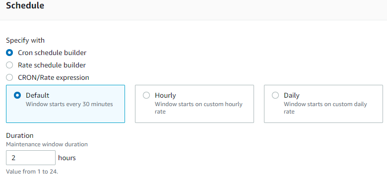**

| **AWS Backup**                                                                                   |                                                                                                                                                                                                                                                                                              |
|--------------------------------------------------------------------------------------------------|----------------------------------------------------------------------------------------------------------------------------------------------------------------------------------------------------------------------------------------------------------------------------------------------|
| *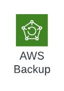* | **AWS Backup:** AWS Backup delivers a centralized data protection by backing all the resources across AWS.  It helps in making backup plans in these plans you we give our backup requirements and in what frequency to backup them. Here it uses our backup plans to tag the AWS resources  |

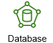

## **Configuring a Backup Plan**

-   System Administrator steps up backup plan for each database
-   Here we set the retention period for the date i.e., it can be done daily for 35 days or for 5 to 7 years

    **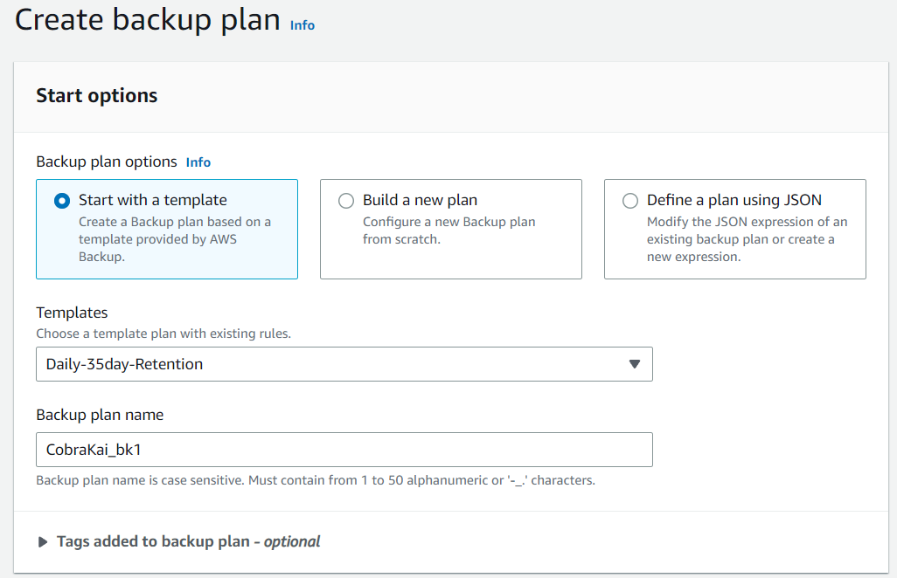**

    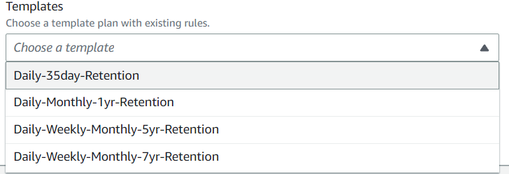

-   The we give a name for out backup as shown in the screenshot
-   Before creating the plan, we create a backup vault where the backup data will be stored

    **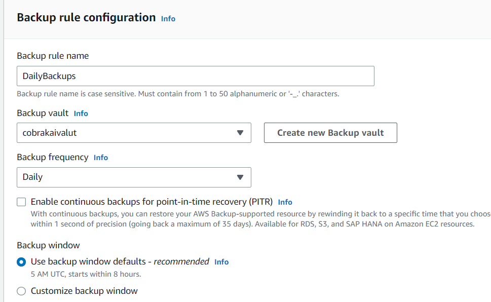**

-   Then press create plan after giving necessary backup information and add this plan to our database which needs regular backup
-   As you can see in the above diagram our backup plan can also provide support to S3 bucket where we migrate our Cobra Kai website from ova file.
-   Whenever the admin wants to retore the backup he just imports this backup and after the backup data is restored, we get a compliance report.

**Usage:**

-   As current cobra kai architecture does not provide backup for its database, if there is change in the configuration that may break the application, these backup data can be used to get the system back up.
-   If there are any accidental deletion or corruption of data system administrator can simply use the backed-up date to bring the service to its previous form

**REFERENCES**

1.  <https://1drv.ms/b/s!AttaTcBEBDkBeAbwiak83gOT5WE?e=C1GJJW>
2.  <https://aws.amazon.com/single-sign-on/faqs/>
3.  https://aws.amazon.com/blogs/aws/new-key-management-service/
4.  https://aws.amazon.com/cloudfront/
5.  https://docs.aws.amazon.com/systemsmanager/latest/userguide/systems-manager-patch.html
6.  https://docs.aws.amazon.com/waf/latest/developerguide/ddosoverview.html
7.  https://www.nclouds.com/blog/security-apps-aws-web-application firewall/
8.  https://docs.aws.amazon.com/IAM/latest/UserGuide/tutorial_users self-manage-mfa-and-creds.html
9.  https://aws.amazon.com/backup/
10. https://docs.aws.amazon.com/elasticloadbalancing/latest/application/introduction.html
11. https://docs.aws.amazon.com/vpn/latest/clientvpn-admin/what-is.html
12. <https://aws.amazon.com/blogs/security/introducing-aws-directory-service-for-microsoft-active-directory-standard-edition/>
13. <https://www.edureka.co/community/32106/what-is-the-job-role-of-aws-administrator>
14. <https://openupthecloud.com/kms-aws-lambda/>
15. <https://www.1cloudhub.com/automate-the-linux-patches-using-aws-system-manager-ssm/>
16. <https://docs.aws.amazon.com/AmazonS3/latest/userguide/ShareObjectPreSignedURL.html>
17. <https://docs.aws.amazon.com/vm-import/latest/userguide/vmimport-image-import.html>
18. <https://www.tecracer.com/blog/2021/09/how-to-hybrid-aws-systems-manager-patch-management.html>
19. <https://aws.amazon.com/blogs/networking-and-content-delivery/introducing-ip-based-routing-for-amazon-route-53/>
20. <https://docs.aws.amazon.com/inspector/latest/user/what-is-inspector.html>
